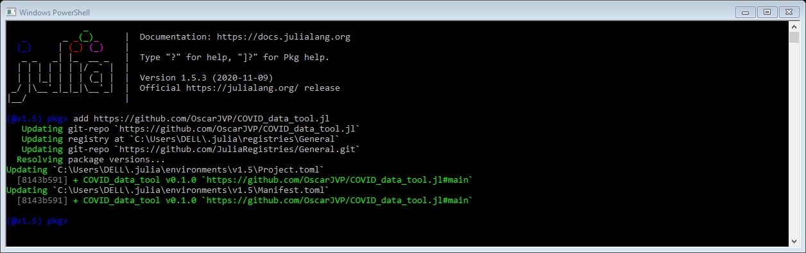
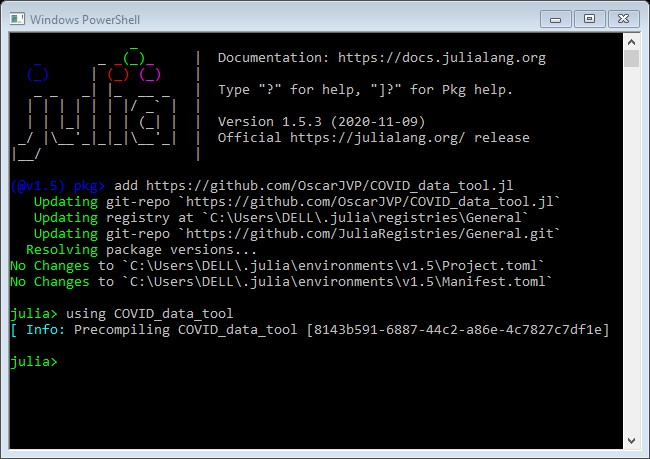

# COVID_data_tool
Paquetería de JULIA creada con el fín de unir datos abiertos sobre casos COVID-19 y demografía de México.\
Probada con JULIA 1.4.2 y 1.5.3

### Prerrequisitos
Paquetes de JULIA necesarios para el funcionamiento de la paquetería.\
    `HTTP`\
    `DataFrames`\
    `CSV`\
    `JSON`

### Instalación
Haciendo uso del REPL de JULIA teclear `]` e ingresar\
    `add https://github.com/OscarJVP/COVID_data_tool.jl`\
    \
    
    \
Compilar paquetería tecleando\
    `using COVID_data_tool`
    \
    
    \
Puedes probarla con\
    `COVID_data_tool.indicadores_disponibles()`

### Funciones
`datos_indicador(indicador:: String, estado:: String)`\
Recibe el indicador a consultar como `String` y el estado como `String`.\
Crea un .csv con la información deseada en la entrada de la función y muestra el nombre del archivo creado.\
\
`datos_municipio(indicadores, estado::String, municipio::String)`\
Recibe el indicador a consultar como `String` y el estado como `String` y el municipio como `String`.\
Crea un .csv con la información deseada en la entrada de la función y muestra el nombre del archivo creado.\
\
`indicadores_disponibles()`\
Muestra la lista de indicadores disponibles para consulta.

## Equipo de Trabajo
Deep Alpha\
\
    - **Carlos Espadín** - *Director de proyecto* -\
    - **Luis Moysén** - *SCRUM Master* -\
    - **Luis Roa** - *Miembro del equpo desarrollador* -\
    - **Rodrígo Vazquez** - *Miembro del equpo desarrollador* -\
    - **Oscar Vargas** - *Miembro del equpo desarrollador* -\
    - **Susan Rodríguez** - *Tester* -\
    - **Eduardo Bacelis** - *Tester* -

## Licencia
Proyecto bajo [MIT License](LICENSE.md) licencia del MIT - Consulte [LICENSE.md](LICENSE.md) para mas detalles.
